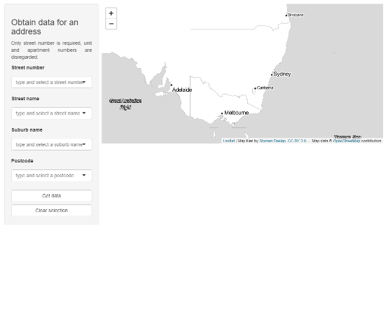

<!-- README.md is generated from README.Rmd. Please edit that file -->

```{r, include = FALSE}
knitr::opts_chunk$set(
  collapse = TRUE,
  comment = "#>",
  fig.path = "man/figures/README-",
  out.width = "100%"
)
```

# futureScenario

<!-- badges: start -->
<!-- badges: end -->

The goal of futureScenario is to ...

## to do

1. Obtain and create useable GNAF data - **done**
2. Incorporate Graemes prediction workflow  
3. Generate reporting outputs  
4. Generate shiny apps

## Installation

<!--
You can install the released version of futureScenario from [CRAN](https://CRAN.R-project.org) with:

``` r
install.packages("futureScenario")
```
-->

And the development version from [GitHub](https://github.com/) with:

``` r
# install.packages("devtools")
devtools::install_github("Shaunson26/futureScenario")
```

```{r, eval=F}
library(futureScenario)
```

```{r, include=FALSE}
library(devtools)
load_all()

options(width = 250)
```

## Data

A flattened and minified GNAF address dataset `?gnaf`

```{r}
head(gnaf)
```

## Functions

`return_address_coords()` is used to query `gnaf`. Currently with exact matches only.
If any query files are missing, there will be a wildcard used for that those fields

```{r}
# An exact match
return_address_coords(street_number = 2, street_name = 'IVY STREET', locality = 'DARLINGTON', postcode = '2008')

# missing street_name returns all street_names matching the rest of the query
return_address_coords(street_number = 2, locality = 'DARLINGTON', postcode = '2008')
```

## API calls

### data-cbr.csiro.au

In development still ...  

Huge raster data are available using NetcdfSubset REST API. Datasets are split by:

- variable  
- year range  
- model  
- greenhouse gas scenario  

Within each dataset, data selection parameters include:  

- variable
- lat/lon  
- date start/end  
- date step  

The object `csiro_catalog` is a named list to help select the dataset for URL building

```{r}
csiro_catalog$variable
csiro_catalog$year_range
csiro_catalog$model
csiro_catalog$rcp
```

We can build the queries using `create_dataset_url()` which uses `httr2`

```{r}
create_dataset_url(variable = csiro_catalog$variable$`Rainfall_(Precipitation)`,
                   model = csiro_catalog$model$`NorESM1-M`,
                   rcp = csiro_catalog$rcp$rcp45,
                   year_range = csiro_catalog$year_range$`2016-2045`)
```

This function is used within `download_netcdf_subset()` along with dataset parameters to
download a netcdf4 file to a temporary location (returned by the function, 
`{randomChars}_{variable}_{model}_{rcp}_{date_range}.nc`). Two download
methods exist - using `download.file()` or `writeBin(body)` from `httr2` methods. The former
is quicker, but seems to fail often. `httr2` methods are more polite? Or the server is under load?

```{r, eval = F}
# TODO - still has bugs

# Get lat/lon
addr <-
  return_address_coords(street_number = 2, street_name = 'IVY STREET', locality = 'DARLINGTON', postcode = '2008')

# download file
downloaded_file_path <-
  download_netcdf_subset(variable = csiro_catalog$variable$`Rainfall_(Precipitation)`,
                         model = csiro_catalog$model$`NorESM1-M`,
                         rcp = csiro_catalog$rcp$rcp85,
                         year_range = csiro_catalog$year_range$`2016-2045`,
                         lat = addr$LATITUDE, lon = addr$LONGITUDE,
                         date_start = '2016-01-01', date_end = '2030-01-01',
                         date_step = 30,
                         method = 'httr2')

raster_data <- stars::read_ncdf(downloaded_file_path, var = 'still_need_to_capture_this')

raster_data %>%
  as_tibble() %>% 
  do_things()
```

eg

```{r, eval = F}
addr <-
  return_address_coords(street_number = 2, street_name = 'IVY STREET', locality = 'DARLINGTON', postcode = '2008')

tmp_fun <- function(x, method){
  download_netcdf_subset(variable = x,
                         model = csiro_catalog$model$`NorESM1-M`,
                         rcp = csiro_catalog$rcp$rcp85,
                         year_range = csiro_catalog$year_range$`2016-2045`,
                         lat = addr$LATITUDE, lon = addr$LONGITUDE,
                         date_start = '2016-01-01', date_end = '2045-12-31',
                         date_step = 30, method = method)
}

rsds <- tmp_fun(csiro_catalog$variable$Solar_Radiation, method = 'httr2')
hurs <- tmp_fun(csiro_catalog$variable$Relative_Humidity, method = 'httr2')
pr <- tmp_fun(csiro_catalog$variable$`Rainfall_(Precipitation)`, method = 'httr2')
tasmin <- tmp_fun(csiro_catalog$variable$Minimum_Temperature, method = 'httr2')
tas <- tmp_fun(csiro_catalog$variable$Mean_Temperature, method = 'httr2')
tasmax <- tmp_fun(csiro_catalog$variable$Maximum_Temperature, method = 'httr2')
wvap <- tmp_fun(csiro_catalog$variable$Evaporation, method = 'httr2')

library(stars)
library(dplyr)
library(ggplot2)

stars_list <-
  list(hurs, pr, tasmin, tas, tasmax, wvap) %>%
  lapply(., function(x){
    # extract variable from filename
    var = strsplit(basename(x), split = '_')[[1]][2]
    # import
    stars::read_ncdf(x, var = var)
  })

# one dataset has weird time class
class_PCICt <- function(x){
  class(x)[1] == 'PCICt'
}

purrr::map_df(zz, function(x){
  x %>%
    as_tibble() %>%
    select(everything(), value = 4) %>%
    mutate(across(where(class_PCICt), as.character),
           time = as.Date(time),
           value = as.numeric(value),
           var = names(x)) %>%
    # may get multiple grids for a give lat/lon so average to 1 value
    group_by(time) %>%
    summarise(value = mean(value)) %>%
    ungroup()
})
```


### Heat vulnerability

call to https://datasets.seed.nsw.gov.au/dataset/...

```{r}
hvi <-
  return_address_coords(street_number = 2, street_name = 'IVY STREET', locality = 'DARLINGTON', postcode = '2008') %>%
  join_sa1() %>%
  dplyr::pull(SA1_MAINCODE_2016) %>%
  get_heat_vulnerability_index(sa1 = .) %>%  # JSON as a list
  map_heat_vulnerability_index()

hvi %>% 
  do.call(rbind.data.frame, .)
```

### Urban vegetation cover

call to https://datasets.seed.nsw.gov.au/dataset/...

```{r}
uvca <-
  return_address_coords(street_number = 2, street_name = 'IVY STREET', locality = 'DARLINGTON', postcode = '2008') %>%
  dplyr::pull(MB_2016_CODE) %>%
  get_urban_vegetation_cover_all(mb = .) %>%  # JSON as a list
  map_urban_vegetation_cover_all()

uvca
```

## Shiny

Shiny apps for exploration and other purposes

```{r, eval = F}
run_gnaf_leaflet_shiny()
```




