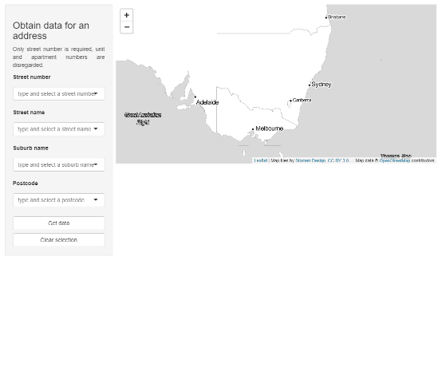

<!-- README.md is generated from README.Rmd. Please edit that file -->

# futureScenario

<!-- badges: start -->
<!-- badges: end -->

The goal of futureScenario is to …

## to do

1.  Obtain and create useable GNAF data - **done**, [see
    vignettes](vignettes/)
    -   revisit this, some addresses are missing
    -   lat/lon as integer to shrink file size
2.  API calls datasets.seed.nsw.gov.au, data-cbr.csiro.au, …
3.  Obtain and aggregate data
4.  Create plumber API
5.  Generate reporting outputs  
6.  Generate shiny apps

## Installation

<!--
You can install the released version of futureScenario from [CRAN](https://CRAN.R-project.org) with:

``` r
install.packages("futureScenario")
```
-->

And the development version from [GitHub](https://github.com/) with:

``` r
# install.packages("devtools")
devtools::install_github("Shaunson26/futureScenario")
```

``` r
library(futureScenario)
```

## Data

A flattened and minified GNAF address dataset with meshblock 2016
boundary `?gnaf`

``` r
head(gnaf)
#> # A tibble: 6 x 7
#>   NUMBER_FIRST STREET_NAME      LOCALITY_NAME POSTCODE LONGITUDE LATITUDE MB_2016_CODE
#>          <int> <chr>            <chr>            <int>     <dbl>    <dbl> <chr>       
#> 1            1 ABERCROMBIE LANE SYDNEY            2000      151.    -33.9 10742401000 
#> 2         5010 ABERCROMBIE LANE SYDNEY            2000      151.    -33.9 10743110000 
#> 3            3 AGAR STEPS       MILLERS POINT     2000      151.    -33.9 11205344000 
#> 4            5 AGAR STEPS       MILLERS POINT     2000      151.    -33.9 11205344000 
#> 5            7 AGAR STEPS       MILLERS POINT     2000      151.    -33.9 11205344000 
#> 6            9 AGAR STEPS       MILLERS POINT     2000      151.    -33.9 11205344000
```

## Functions

`return_address_coords()` is used to query `gnaf`. Currently with exact
matches only. If any query files are missing, there will be a wildcard
used for that those fields

``` r
# An exact match
return_address_coords(street_number = 2, street_name = 'IVY STREET', locality = 'DARLINGTON', postcode = '2008')
#> # A tibble: 1 x 7
#>   NUMBER_FIRST STREET_NAME LOCALITY_NAME POSTCODE LONGITUDE LATITUDE MB_2016_CODE
#>          <int> <chr>       <chr>            <int>     <dbl>    <dbl> <chr>       
#> 1            2 IVY STREET  DARLINGTON        2008      151.    -33.9 10755400000

# missing street_name returns all street_names matching the rest of the query
return_address_coords(street_number = 2, locality = 'DARLINGTON', postcode = '2008')
#> # A tibble: 8 x 7
#>   NUMBER_FIRST STREET_NAME         LOCALITY_NAME POSTCODE LONGITUDE LATITUDE MB_2016_CODE
#>          <int> <chr>               <chr>            <int>     <dbl>    <dbl> <chr>       
#> 1            2 CALDER ROAD         DARLINGTON        2008      151.    -33.9 10755730000 
#> 2            2 EDWARD STREET       DARLINGTON        2008      151.    -33.9 10756590000 
#> 3            2 GOLDEN GROVE STREET DARLINGTON        2008      151.    -33.9 11205732600 
#> 4            2 IVY LANE            DARLINGTON        2008      151.    -33.9 10755400000 
#> 5            2 IVY STREET          DARLINGTON        2008      151.    -33.9 10755400000 
#> 6            2 LANDER STREET       DARLINGTON        2008      151.    -33.9 10756580000 
#> 7            2 SHEPHERD LANE       DARLINGTON        2008      151.    -33.9 10751380000 
#> 8            2 THOMAS STREET       DARLINGTON        2008      151.    -33.9 10752920000
```

## API calls

### data-cbr.csiro.au

<https://www.climatechangeinaustralia.gov.au/en/obtain-data/download-datasets/>

Huge raster data are available using NetcdfSubset REST API. Datasets are
split by:

-   variable  
-   year range  
-   model  
-   greenhouse gas scenario (representative concentration pathways, RCP)

Within each dataset, data selection parameters include:

-   variable
-   lat/lon  
-   date start/end  
-   date step

The object `csiro_catalog (R/csiro_catalog.R)` is a named list to help
select the dataset for URL building

``` r
csiro_catalog$variable
#> $Solar_Radiation
#> [1] "Solar_Radiation"
#> 
#> $Relative_Humidity
#> [1] "Relative_Humidity"
#> 
#> $`Rainfall_(Precipitation)`
#> [1] "Rainfall_(Precipitation)"
#> 
#> $Minimum_Temperature
#> [1] "Minimum_Temperature"
#> 
#> $Mean_Temperature
#> [1] "Mean_Temperature"
#> 
#> $Maximum_Temperature
#> [1] "Maximum_Temperature"
#> 
#> $Evaporation
#> [1] "Evaporation"
```

``` r
csiro_catalog$year_range
#> $`2016-2045`
#> [1] "2016-2045"
#> 
#> $`2036-2066`
#> [1] "2036-2066"
#> 
#> $`2056-2085`
#> [1] "2056-2085"
#> 
#> $`2075-2104`
#> [1] "2075-2104"
```

``` r
csiro_catalog$model
#> $`NorESM1-M`
#> [1] "NorESM1-M"
#> 
#> $MIROC5
#> [1] "MIROC5"
#> 
#> $`HadGEM2-CC`
#> [1] "HadGEM2-CC"
#> 
#> $`GFDL-ESM2M`
#> [1] "GFDL-ESM2M"
#> 
#> $CanESM2
#> [1] "CanESM2"
#> 
#> $`CNRM-CM5`
#> [1] "CNRM-CM5"
#> 
#> $`CESM1-CAM5`
#> [1] "CESM1-CAM5"
#> 
#> $`ACCESS1-0`
#> [1] "ACCESS1-0"
```

``` r
csiro_catalog$rcp
#> $rcp45
#> [1] "rcp45"
#> 
#> $rcp85
#> [1] "rcp85"
```

``` r
csiro_catalog$filename
#> [1] "{variable}_aus_{model}_{rcp}_r1i1p1_CSIRO-{something}-wrt-1986-2005-Scl_v1_day_{year_range}.nc"
```

We can build the queries using `create_dataset_url()` which usesv
`csiro_catalog`, some hardcoded URLs (wihtin the function) and the
package `httr2`.

``` r
create_dataset_url(variable = csiro_catalog$variable$`Rainfall_(Precipitation)`,
                   model = csiro_catalog$model$`NorESM1-M`,
                   rcp = csiro_catalog$rcp$rcp45,
                   year_range = csiro_catalog$year_range$`2016-2045`)
#> <httr2_request>
#> GET
#> https://data-cbr.csiro.au/thredds/ncss/catch_all/oa-aus5km/Climate_Change_in_Australia_User_Data/Application_Ready_Data_Gridded_Daily/Rainfall_(Precipitation)/2016-2045/pr_aus_NorESM1-M_rcp45_r1i1p1_CSIRO-DecCh-wrt-1986-2005-Scl_v1_day_2016-2045.nc
#> Body: empty
```

This function is used within `download_netcdf_subset()` along with API
query parameters to download a dataset netcdf4 file to a temporary
location(the path is returned by the function,
`{randomChars}_{variable}_{model}_{rcp}_{date_range}.nc`). Of note is
the coordinates requested: either `lat`/`lon` or a bounding box `bbox`
can be used. A NSW bounding box `nsw_bbox` is shipped with the package.
Also two download methods exist - using `download.file()` or
`writeBin(body)` from `httr2`. The former is quicker, but seems to fail
often. `httr2` methods are more polite? Or the CSIRO server is under
load when running these?

``` r
# Get lat/lon
addr <-
  return_address_coords(street_number = 2, street_name = 'IVY STREET', locality = 'DARLINGTON', postcode = '2008')

# download file
downloaded_file_path <-
  download_netcdf_subset(variable = csiro_catalog$variable$`Rainfall_(Precipitation)`,
                         model = csiro_catalog$model$`NorESM1-M`,
                         rcp = csiro_catalog$rcp$rcp85,
                         year_range = csiro_catalog$year_range$`2016-2045`,
                         lat = addr$LATITUDE, lon = addr$LONGITUDE,
                         #bbox = nsw_bbox,
                         date_start = '2016-01-01', date_end = '2016-01-03',
                         date_step = 2,
                         method = 'httr2')

raster_data <- stars::read_ncdf(downloaded_file_path, var = get_var_from_path(downloaded_file_path))

raster_data

raster_data %>% 
  tibble::as_tibble()
```

#### Example bulk download

Create a function with set parameters for model, rcp, years, dates and
vary the variable parameter.

``` r
bulk_download <- function(x, address_df){
  download_netcdf_subset(variable = x,
                         model = csiro_catalog$model$`NorESM1-M`,
                         rcp = csiro_catalog$rcp$rcp85,
                         year_range = csiro_catalog$year_range$`2016-2045`,
                         lat = address_df$LATITUDE, lon = address_df$LONGITUDE,
                         date_start = '2016-01-01', date_end = '2045-12-31',
                         date_step = 365, method = 'httr2')
}

address <-
  return_address_coords(locality = 'PENRITH') %>% 
  dplyr::slice(sample(dplyr::n(), 1))

# Download separately in case of connection errors
rsds <- 
  bulk_download(csiro_catalog$variable$Solar_Radiation, 
                address_df = address)
hurs <- 
  bulk_download(csiro_catalog$variable$Relative_Humidity, 
                address_df = address)
pr <- 
  bulk_download(csiro_catalog$variable$`Rainfall_(Precipitation)`, 
                address_df = address)
tasmin <- 
  bulk_download(csiro_catalog$variable$Minimum_Temperature, 
                address_df = address)
tas <- 
  bulk_download(csiro_catalog$variable$Mean_Temperature, 
                address_df = address)
tasmax <- 
  bulk_download(csiro_catalog$variable$Maximum_Temperature, 
                address_df = address)
wvap <- 
  bulk_download(csiro_catalog$variable$Evaporation, 
                address_df = address)

library(stars)
library(dplyr)
library(ggplot2)

stars_list <-
  list(hurs, pr, tasmin, tas, tasmax, wvap) %>%
  lapply(., function(x){
    # extract variable from filename
    var = strsplit(basename(x), split = '_')[[1]][2]
    # import
    stars::read_ncdf(x, var = var)
  })

# one dataset has weird time class
class_PCICt <- function(x){
  class(x)[1] == 'PCICt'
}

purrr::map_df(zz, function(x){
  x %>%
    as_tibble() %>%
    select(everything(), value = 4) %>%
    mutate(across(where(class_PCICt), as.character),
           time = as.Date(time),
           value = as.numeric(value),
           var = names(x)) %>%
    # may get multiple grids for a give lat/lon so average to 1 value
    group_by(time) %>%
    summarise(value = mean(value)) %>%
    ungroup()
})
```

### Heat vulnerability

call to <https://datasets.seed.nsw.gov.au/dataset/>…

``` r
hvi <-
  return_address_coords(street_number = 2, street_name = 'IVY STREET', locality = 'DARLINGTON', postcode = '2008') %>%
  join_sa1() %>%
  dplyr::pull(SA1_MAINCODE_2016) %>%
  get_heat_vulnerability_index(sa1 = .) %>%  # JSON as a list
  map_heat_vulnerability_index()

hvi %>% 
  do.call(rbind.data.frame, .)
#>   c..Heat.vulnerability.index....3....moderate.. c..Exposure.index....2....low.moderate.. c..Sensitivity.index....5....high.. c..Adaptive.capacity....4....low.moderate..
#> 1                       Heat vulnerability index                           Exposure index                   Sensitivity index                           Adaptive capacity
#> 2                                              3                                        2                                   5                                           4
#> 3                                       moderate                             low-moderate                                high                                low-moderate
```

### Urban vegetation cover

call to <https://datasets.seed.nsw.gov.au/dataset/>…

``` r
uvca <-
  return_address_coords(street_number = 2, street_name = 'IVY STREET', locality = 'DARLINGTON', postcode = '2008') %>%
  dplyr::pull(MB_2016_CODE) %>%
  get_urban_vegetation_cover_all(mb = .) %>%  # JSON as a list
  map_urban_vegetation_cover_all()

uvca
#> # A tibble: 6 x 3
#>   label                          value_text     value
#>   <chr>                          <fct>          <dbl>
#> 1 Percent any vegetation         10 to 20%     16.8  
#> 2 Percent grass                  Less than 10%  0.156
#> 3 Percent shrubs                 Less than 10%  0.765
#> 4 Percent short trees (3-10 m)   Less than 10%  4.95 
#> 5 Percent medium tress (10-15 m) Less than 10%  5.66 
#> 6 Percent tall trees (>15 m)     Less than 10%  5.30
```

## Shiny

Shiny apps for exploration and other purposes

``` r
run_gnaf_leaflet_shiny()
```


